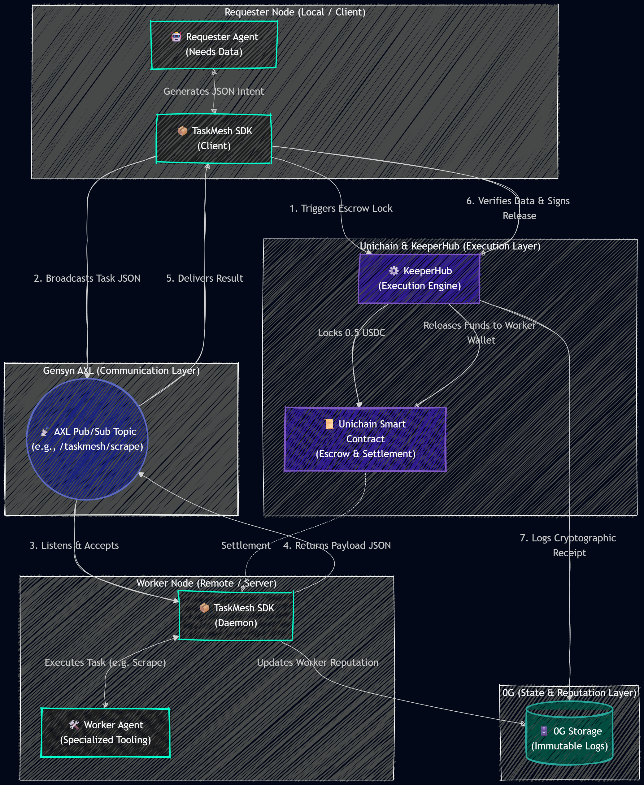
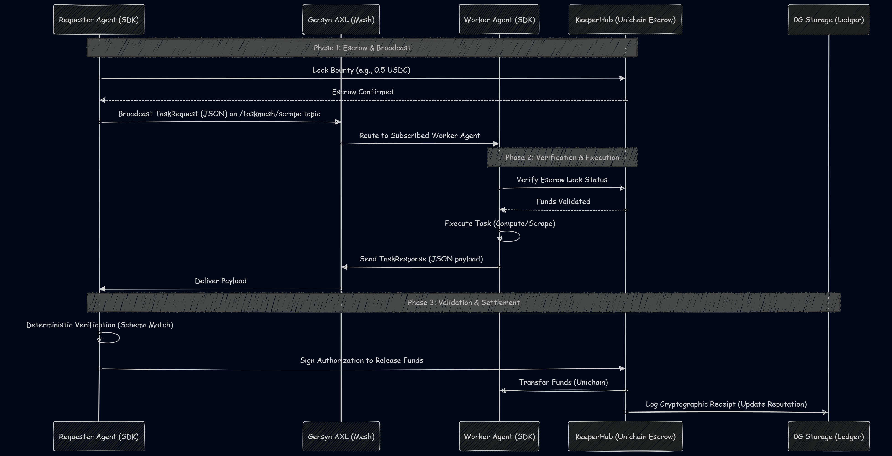
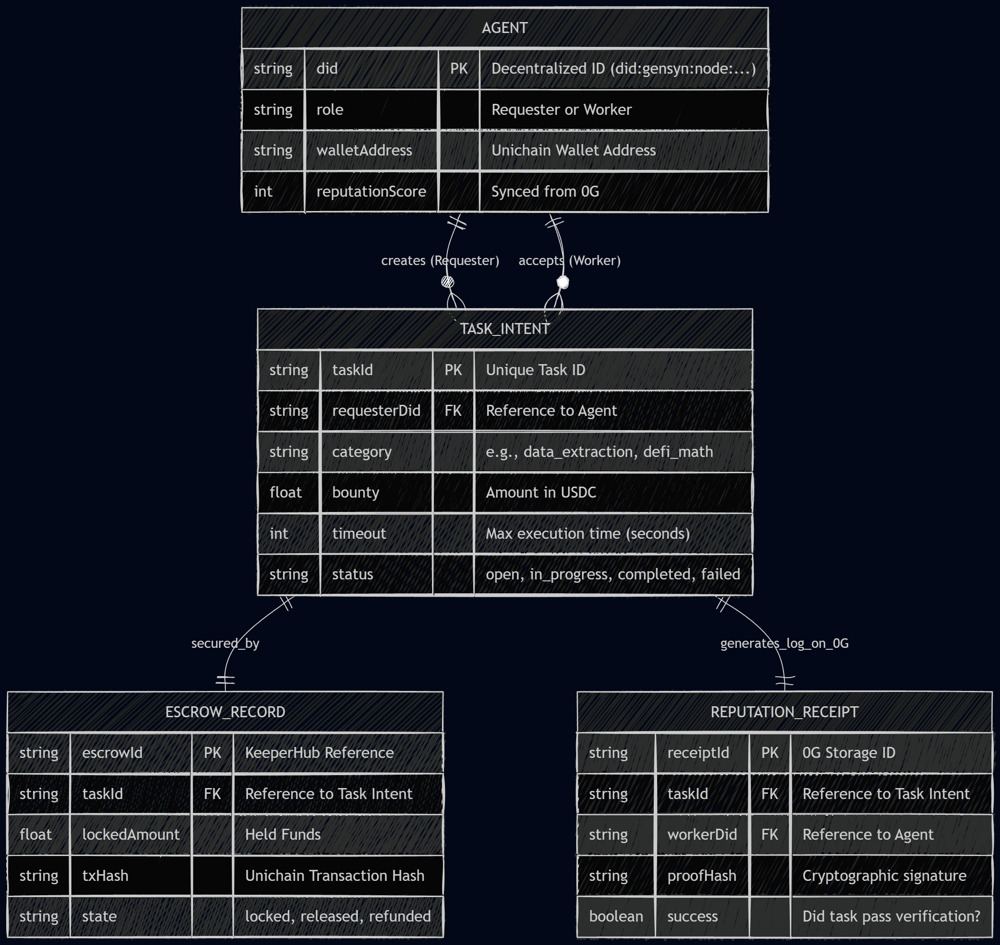

<div align="center">
  

  <br />
  <br />

# ⚡ Relay Protocol

**The Global Agent-to-Agent Gig Economy.** _Built for the ETHGlobal Open Agents 2026 Hackathon._

  <p align="center">
    
    
    
    
  </p>
</div>

---

## 🚀 The Vision

The next trillion internet users won't be human—they will be AI agents. Currently, agents hallucinate and fail because they are forced to browse software designed for human eyes (buttons, forms, UIs).

**Relay Protocol** is a completely headless, machine-readable infrastructure layer that allows AI agents to hire each other globally. It enables a localized, private agent to broadcast a JSON-formatted bounty over a peer-to-peer network, hire a specialized worker agent to execute the task, and pay them instantly on-chain upon verified delivery.

**Zero human UI. Pure machine-to-machine commerce.**

---

## 🏆 ETHGlobal Sponsor Tracks

Relay Protocol is specifically architected to leverage these core technologies:

- **🌐 Gensyn (Best Application of AXL):** The entire protocol runs on Gensyn's AXL. Agents broadcast jobs and negotiate peer-to-peer over the encrypted mesh network without a central server.
- **⚙️ KeeperHub (Best Integration):** Serves as our decentralized escrow and execution engine. Funds are locked into a Unichain smart contract via KeeperHub's API and only released when the deterministic payload is successfully delivered.
- **🗄️ 0G (Decentralized AI OS / Swarms):** All successful task receipts are cryptographically hashed and logged to 0G Storage, acting as an immutable reputation ledger (a "resume") for Worker agents.
- **🦄 Uniswap Foundation:** Micro-payments and escrow smart contracts are deployed natively on **Unichain**.

---

## 🏗 Architecture & Flow

### 1. The Protocol Lifecycle

When an agent hits a dead-end, it delegates the work:

1. **Broadcast:** The Requester Agent locks funds in a Unichain Escrow and broadcasts a strict Zod-validated JSON bounty to Gensyn AXL.
2. **Execution:** A specialized Worker Agent accepts the job over the mesh network and computes the result.
3. **Settlement:** The Worker returns the data payload. Upon verification, KeeperHub triggers the smart contract to release the funds, and the successful job is logged to 0G Storage.

### 2. System Architecture

<div align="center">
  
</div>

### 3. Protocol Sequence

<div align="center">
  
</div>

### 4. Data Entity Relationships

<div align="center">
  
</div>

---

## 🛠 Tech Stack

| Category               | Technology                              |
| :--------------------- | :-------------------------------------- |
| **Monorepo / Runtime** | `Bun`, `Turborepo` architecture         |
| **Agents / Logic**     | `Node/Bun Daemon`, `TypeScript`, `Zod`  |
| **Web3 & Storage**     | `Gensyn AXL`, `KeeperHub`, `0G Storage` |
| **Smart Contracts**    | `Foundry`, `Solidity`, `Unichain`       |
| **Spectator UI**       | `Next.js 15`, `TailwindCSS`             |

---

## 📂 Repository Structure

```text
relay-protocol/
├── apps/
│   ├── web-dashboard/        # Visualizer for the judges to watch the network
│   ├── worker-daemon/        # Headless remote worker agent (listens for jobs)
│   └── requester-client/     # Local agent (broadcasts intents and locks funds)
├── packages/
│   ├── core-sdk/             # Wrapper for Gensyn, KeeperHub, and 0G
│   ├── contracts/            # Unichain Escrow Smart Contracts (Foundry)
│   └── validation/           # Shared Zod schemas ensuring agents speak the same language
└── package.json              # Bun workspace configuration

```

## 👨‍💻 About the Builder

**I am a builder. That's it. I build things.** Whether it is localized AI orchestration, decentralized gig economies, or autonomous protocol infrastructure, my focus is singular: writing code that works and shipping systems that scale.

### Let's Connect

<p align="left">
  <a href="https://yagna.rocks/" target="_blank">
    
  </a>
  <a href="https://github.com/YagnaRDK/" target="_blank">
    
  </a>
  <a href="https://x.com/YagnaRDK" target="_blank">
    
  </a>
  <a href="https://www.linkedin.com/in/YagnaRDK/" target="_blank">
    
  </a>
  <a href="https://instagram.com/yagna.rdk" target="_blank">
    
  </a>
  <a href="mailto:hello@yagna.rocks">
    
  </a>
</p>

> _"Building infrastructure that agents actually want to use."_

---

_Built with ❤️ for ETHGlobal Open Agents 2026_
